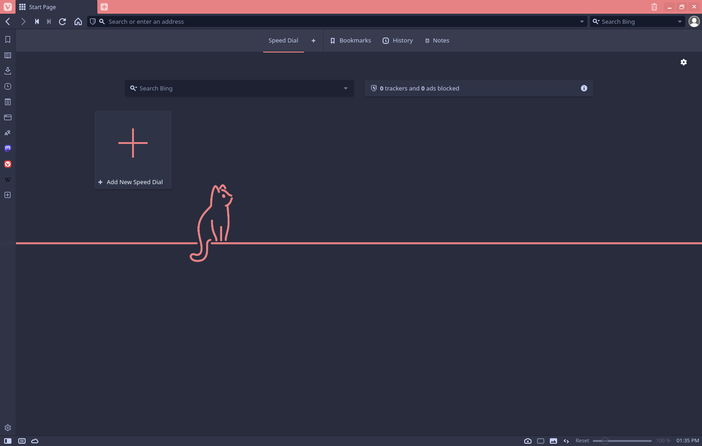
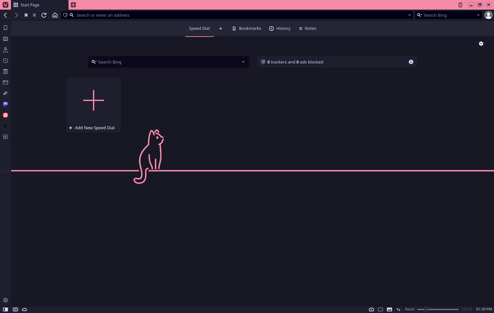

<h3 align="center">
	<br/>
	
	Catppuccin for <a href="https://vivaldi.com/">Vivaldi</a>
	
</h3>

<p align="center">
	<a href="https://github.com/catppuccin/vivaldi/stargazers"></a>
	<a href="https://github.com/catppuccin/vivaldi/issues"></a>
	<a href="https://github.com/catppuccin/vivaldi/contributors"></a>
</p>

<p align="center">
	
</p>

## Previews

<details>
<summary>🌻 Latte</summary>

</details>
<details>
<summary>🪴 Frappé</summary>

</details>
<details>
<summary>🌺 Macchiato</summary>

</details>
<details>
<summary>🌿 Mocha</summary>

</details>
<details>
<summary>🌙 Mocha Amoled</summary>

</details>
<details>
<summary>Flat variant themes</summary>

</details>
<details>
<summary>🌻 Latte Flat</summary>

</details>
<details>
<summary>🪴 Frappé Flat</summary>

</details>
<details>
<summary>🌺 Macchiato Flat</summary>

</details>
<details>
<summary>🌿 Mocha Flat</summary>

</details>
<details>
<summary>🌙 Mocha Amoled Flat</summary>

</details>

## Usage

140 themes are available.

1. Go to [releases](https://github.com/catppuccin/vivaldi/releases).
2. Download your favourite variant, flavour, and colour tarball.
3. Launch Vivaldi, then go to `Settings` -> `Themes` -> `Open Theme…` and open a downloaded tarball.

<details>
<summary>🎶 Variants</summary>

- Default: 4 flavours and 14 colours (56 themes)
- Flat: 4 flavours and 14 colours (56 themes)
- Amoled: Custom flavour based Mocha and 14 colours (14 themes)
- Amoled Flat: Custom flavour based Mocha and 14 colours (14 themes)

</details>

<details>
<summary>😸 Flavours</summary>

- Latte
- Frappe
- Macchiato
- Mocha

</details>

<details>
<summary>🎨 Colours</summary>

- Flamingo
- Pink
- Mauve
- Red
- Maroon
- Peach
- Yellow
- Green
- Teal
- Sky
- Sapphire
- Blue
- Lavender

</details>

<details>
<summary>🔨 Build themes</summary>

Requirements:

- Deno

Build themes:

```shell
make
```

Clean build artifacts:

```shell
make clean
```

Generate UUIDs (for [./uuid_map.json](./uuid_map.json)):

```shell
# Generate an UUID
deno run ./generate_uuid.ts

# Output:
# d68abdeb-df85-4f67-adea-8f0afdf1040b

# Generate UUIDs for n times
n=13
seq $n | while read; do deno run ./generate_uuid.ts; done

# Output:
# fd8a9a3a-3579-4893-8ddf-1361fd708c4a
# 6a8e90e1-033f-483a-83a2-d6f336e7ba05
# 39ea929a-074e-4f0c-a03c-6cb9d25e310f
# 99f6b6b3-e658-4d42-9d0d-bbfad5dd6116
# 22aae3bc-927b-402a-8b89-ab14f9d6a59c
# a5e6a545-89b9-4998-b211-d78f2a0fa051
# f9b4d9d2-6d6c-4934-81d6-3bc6e1937485
# 4f5f3be1-1c94-481f-b54b-45e3d0ca02cd
# 1d17e6e9-2d79-44b6-a928-e658db3bcf25
# 044a4359-da20-4628-8126-c6fee3e355ae
# e3cebbc5-7182-4340-a90d-451393a9d3a9
# 529a3635-bc8e-4264-b622-cd48bf57f8a2
# 3f08b73c-085b-436c-ae44-e3015d78d798
```
</details>

## 💝 Thanks to

- [Konosuke Sakai](https://github.com/sakkke)

&nbsp;

<p align="center">
	
</p>

<p align="center">
	Copyright &copy; 2021-present <a href="https://github.com/catppuccin" target="_blank">Catppuccin Org</a>
</p>

<p align="center">
	<a href="https://github.com/catppuccin/catppuccin/blob/main/LICENSE"></a>
</p>
